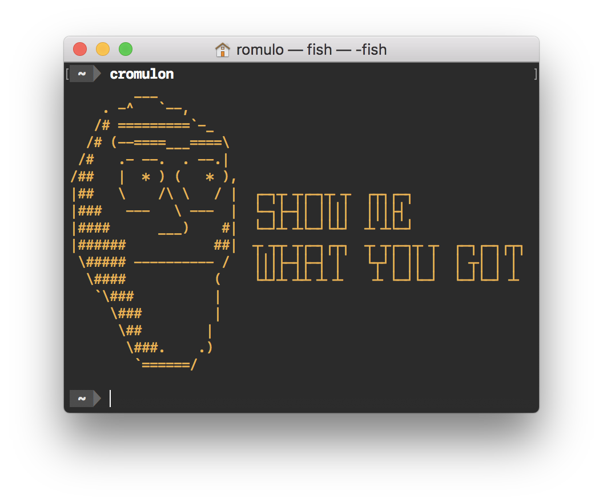

[Fish Shell]: https://fishshell.com
[Fisherman]: https://fisherman.github.io/

#  fish-cromulon

A [Fish Shell] plugin for a Planet Music audition call



## Install

With [Fisherman]

```shell
$ fisher romulof/fish-cromulon
```

## Usages

* Directly call the function:

  ```shell
  $ cromulon
  ```
  
* Use it in your terminal greeting. In your `~/.config/fish/config.fish` or `~/.config/fish/functions/fish_greeting.fish`:

  ```fish
  function fish_greeting
    cromulon
  end
  ```
  
# Next steps

- [ ] Support color parameter
- [ ] Separate text and head colors
- [ ] Take off your pants and your panties
- [ ] Shit on the floor
- [ ] Get schwifty in here